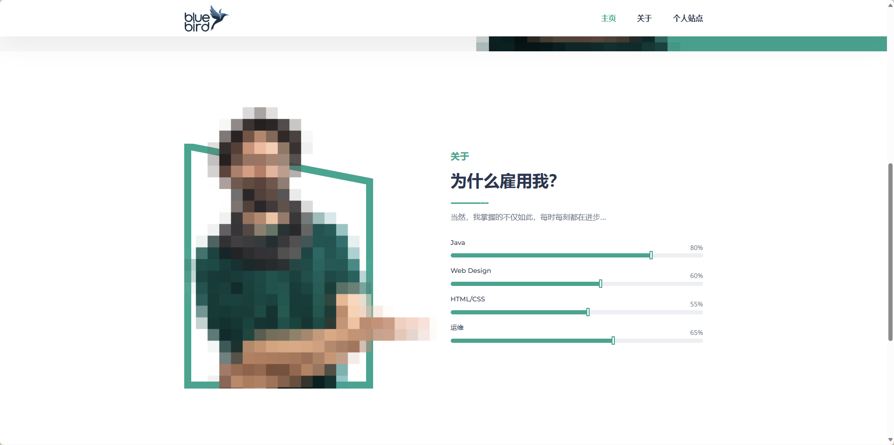

# 个人主页项目

这是一个使用 Vue 3 和 Vite 开发的个人主页项目。该项目展示了一个简洁的个人介绍页面,包含多个部分来展示个人信息和技能。

## 项目结构

```
homepage/
├── .vscode/
│ └── extensions.json
├── public/
│ └── favicon.ico
├── src/
│ ├── assets/
│ │ ├── css/
│ │ │ ├── all.min.css
│ │ │ ├── base.css
│ │ │ ├── bootstrap.min.css
│ │ │ ├── default.css
│ │ │ ├── iconfont.css
│ │ │ ├── lineicons.css
│ │ │ ├── main.css
│ │ │ └── style.css
│ │ ├── fonts/
│ │ ├── images/
│ │ └── js/
│ │ ├── main.js
│ │ └── showData/
│ │ └── socialLinks.json
│ ├── components/
│ │ ├── About.vue
│ │ ├── Footer.vue
│ │ ├── Header.vue
│ │ ├── PersonalWebsite.vue
│ │ └── icons/
│ │ └── IconDocumentation.vue
│ ├── App.vue
│ ├── main.js
│ ├── router.js
│ └── assets/
├── .gitignore
├── index.html
├── jsconfig.json
├── package.json
├── package-lock.json
└── vite.config.js

```

## 技术栈

- Vue 3
- Vite
- CSS (包括Flexbox布局)
- JavaScript
- HTML

## 页面结构

主页面 (App.vue) 包含以下几个主要部分:

1. 头部 (Header): 显示名字和职业
2. 导航栏 (Nav): 包含多个导航链接
3. 主要内容区域:
   - 关于我 (About Me)
   - 技能 (Skills)
   - 项目 (Projects)
   - 联系方式 (Contact)

每个部分都使用了响应式设计,确保在不同设备上都能良好显示。

## 开发环境设置

推荐使用以下IDE设置:

- [VSCode](https://code.visualstudio.com/)
- [Volar](https://marketplace.visualstudio.com/items?itemName=Vue.volar) 扩展 (请禁用 Vetur)

## 项目配置

如需自定义配置,请参考 [Vite 配置文档](https://cn.vitejs.dev/config/)。

## 项目启动步骤

1. 克隆项目:

```sh
git clone https://github.com/long-dotcom/homepage.git
cd homepage
```

2. 安装依赖:

```sh
npm install
```

3. 开发模式运行 (支持热重载):

```sh
npm run dev
```

4. 生产环境构建:

```sh
npm run build
```

## 功能特性

- 响应式设计,适配不同屏幕尺寸
- 简洁明了的个人介绍布局
- 技能展示区域
- 项目展示区域
- 联系方式部分
- 平滑滚动效果
- 导航栏固定在顶部

## 自定义

您可以通过编辑 `App.vue` 文件来自定义页面内容,包括:

- 更新个人信息
- 修改技能列表
- 添加或删除项目
- 更新联系方式

样式可以在 `<style>` 部分进行调整,以满足您的个人喜好。

## 贡献指南

欢迎贡献!如果您想为这个项目做出贡献,请遵循以下步骤:

1. Fork 这个仓库
2. 创建您的特性分支 (`git checkout -b feature/AmazingFeature`)
3. 提交您的更改 (`git commit -m 'Add some AmazingFeature'`)
4. 推送到分支 (`git push origin feature/AmazingFeature`)
5. 开启一个 Pull Request

## 许可证

此项目采用 MIT 许可证。详情请见 [LICENSE](LICENSE) 文件。

## 模板来源

本项目基于 [UIdeck](https://uideck.com/) 提供的模板。具体信息可在 `Footer.vue` 文件中找到,其中包含以下声明:

```html
<p class="credit pt-45">模板设计与开发由<a href="https://uideck.com/">UIdeck</a>提供</p>
```

我们对原始模板进行了以下主要修改:

- 将模板从原始的HTML/CSS/JavaScript结构转换为Vue 3组件结构
- 使用Vite作为构建工具,提高开发效率
- 调整了项目结构以适应Vue单文件组件的组织方式
- 添加了自定义组件和页面布局
- 实现了响应式设计
- 增加了个人信息、技能展示、项目展示等特定部分

我们衷心感谢UIdeck提供的优秀模板,它为本项目提供了坚实的基础。同时,我们也鼓励用户在此基础上进行进一步的个性化定制,以创建独特的个人主页。

请注意,使用此模板时应遵守UIdeck的许可条款。详细信息请参考他们的官方网站或`Footer.vue`文件中的相关说明。

## 联系方式

如果您有任何问题或建议,请通过以下方式联系我:

- GitHub: [@long-dotcom](https://github.com/long-dotcom)
- 项目链接: [https://github.com/long-dotcom/homepage](https://github.com/long-dotcom/homepage)

## 屏幕截图

| 首页 |              项目展示              |
|:---:|:------------------------------:|
|  |  |
